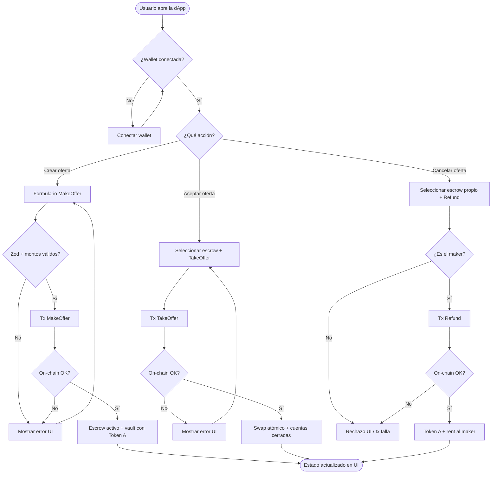
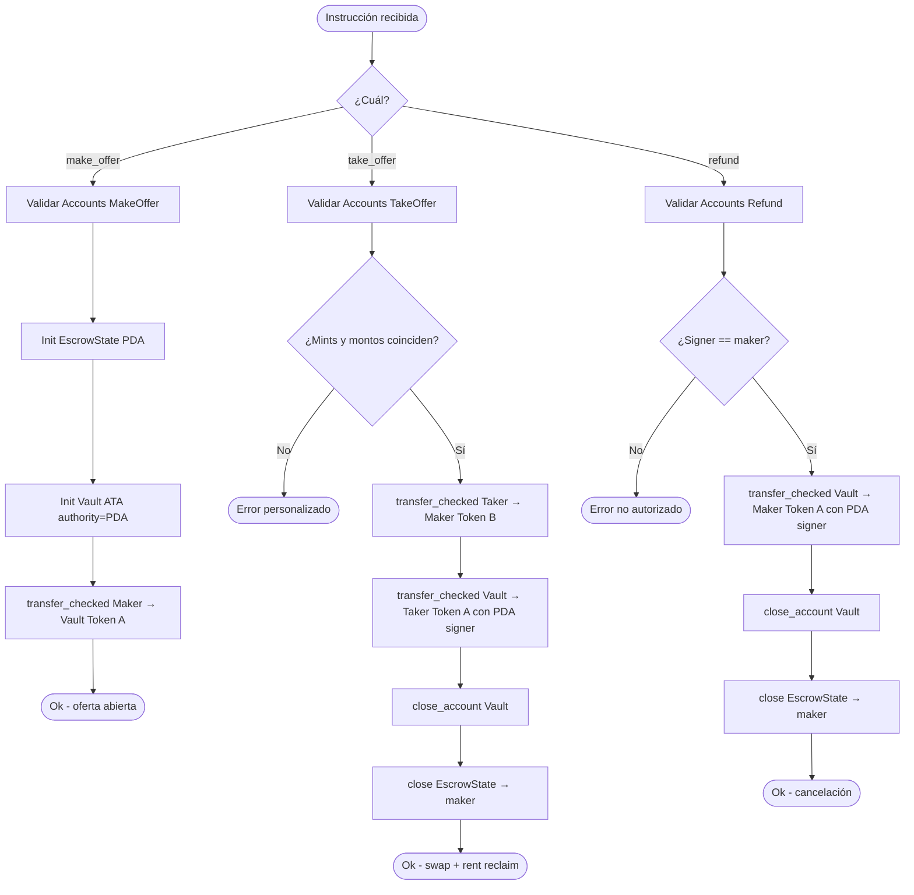
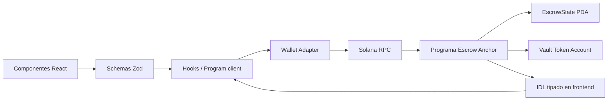

# Diagrama de flujo del sistema

Vista de alto nivel: decisiones y caminos del escrow (on-chain + frontend).

## 1. Flujo general del producto

## 2. Flujo de decisión on-chain (programa)

## 3. Flujo de datos frontend ↔ cadena

## Notas de diseño

- Toda transferencia usa `transfer_checked` (decimals explícitos).
- El vault siempre tiene como authority el PDA `EscrowState`.
- TakeOffer y Refund cierran vault + estado y devuelven rent al maker.
- El frontend no asume cuentas: valida con Zod antes de armar la tx.
