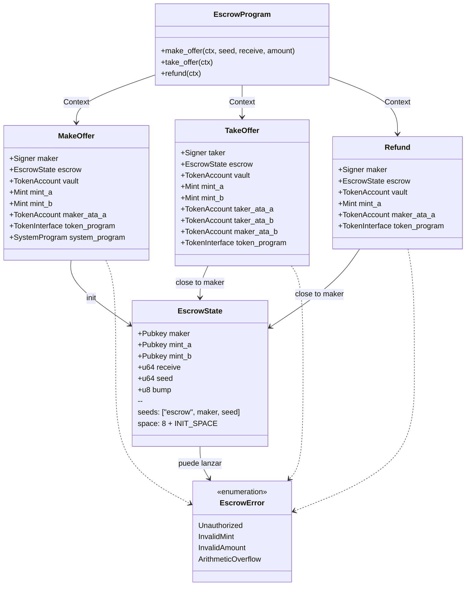
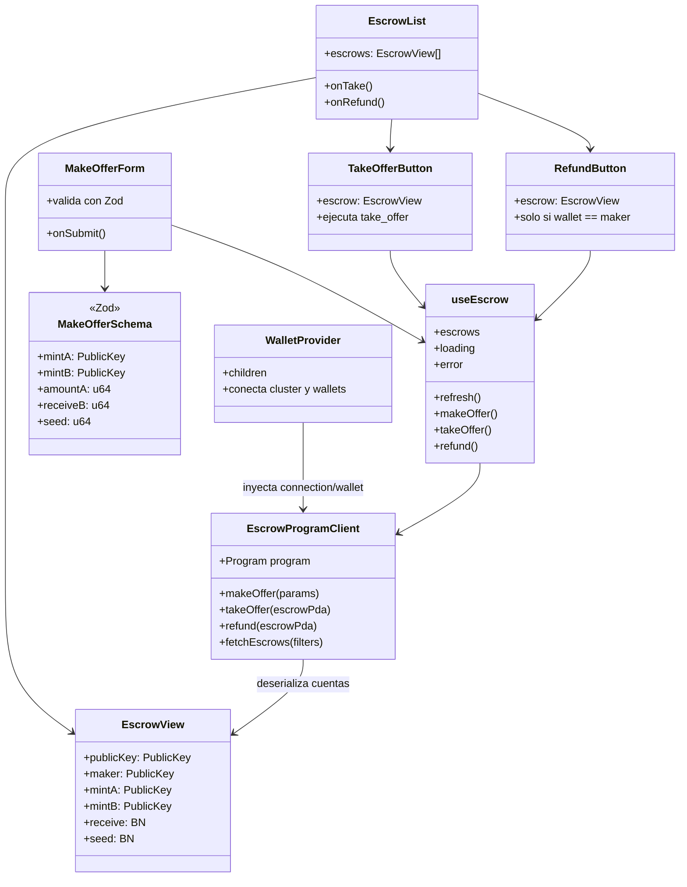
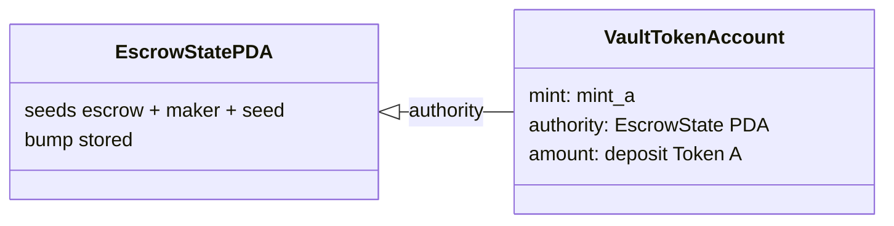

# Diagrama de clases / estructura

Modelo de cuentas on-chain, módulos del programa y capas del frontend. En Solana no hay OOP clásica: las “clases” representan cuentas, contextos e interfaces TypeScript.

## 1. On-chain (programa Anchor)

### Layout de `EscrowState` (orden por tamaño)

| Campo | Tipo | Bytes |
|-------|------|-------|
| discriminator | — | 8 |
| maker | Pubkey | 32 |
| mint_a | Pubkey | 32 |
| mint_b | Pubkey | 32 |
| receive | u64 | 8 |
| seed | u64 | 8 |
| bump | u8 | 1 |
| **Total aprox.** | | **~121** |

Objetivo: mantener el estado **bajo 128 bytes** para minimizar rent.

---

## 2. Frontend (Next.js App Router)

---

## 3. Relación vault ↔ PDA

La authority del vault **nunca** es el maker ni el taker: solo el PDA puede firmar retiros vía `signer_seeds`.
