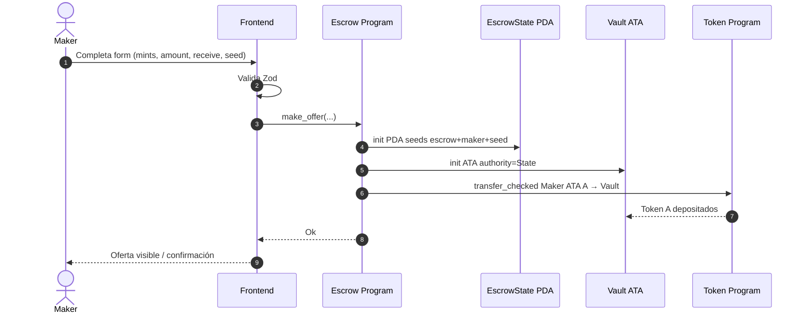
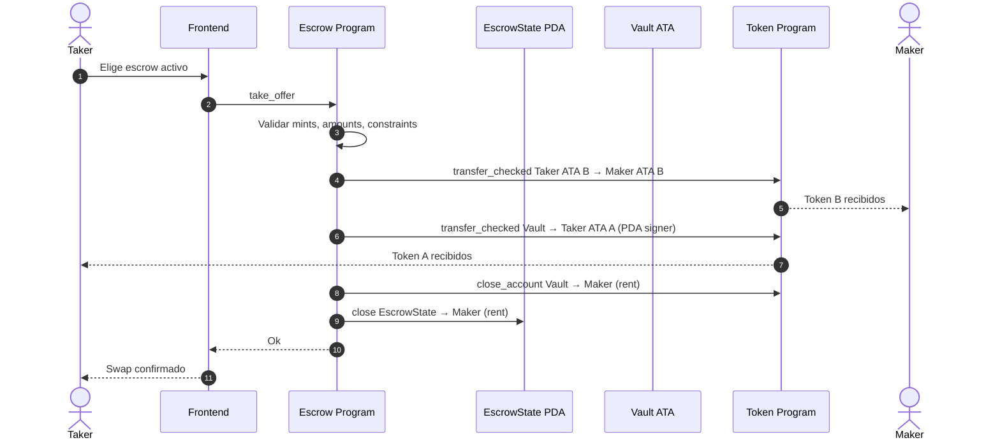
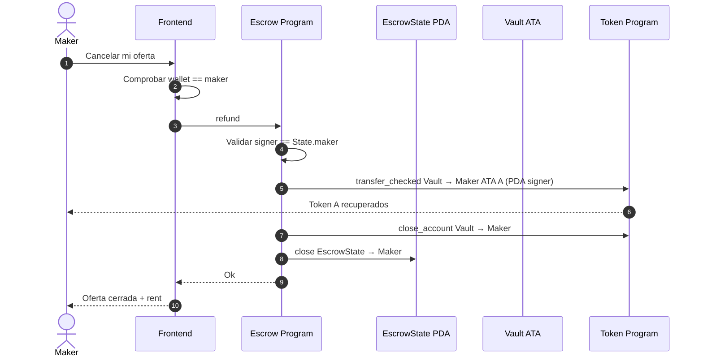
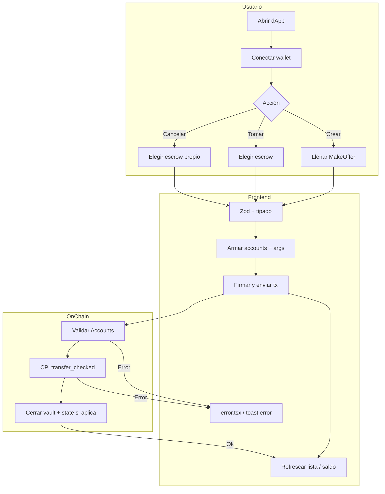
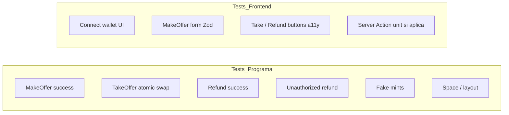

# Flujograma de procesos

Secuencias temporales (pasos ordenados) para cada instrucción y para el usuario en la dApp.

## 1. MakeOffer — secuencia on-chain

## 2. TakeOffer — swap atómico

## 3. Refund — cancelación por maker

## 4. Flujograma UX de la dApp (swimlanes)

## 5. Matriz de cierre de cuentas

| Instrucción | Token A | Token B | Vault | EscrowState | Rent |
|-------------|---------|---------|-------|-------------|------|
| MakeOffer | Maker → Vault | — | init | init | Maker paga |
| TakeOffer | Vault → Taker | Taker → Maker | close | close → maker | Maker recupera |
| Refund | Vault → Maker | — | close | close → maker | Maker recupera |

## 6. Casos de prueba obligatorios (alineados a reglas)

Orden TDD: escribir el test de la columna correspondiente **antes** de la lógica Rust o del componente React.
